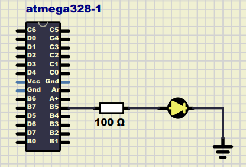

# Lab 1: Ondřej Soukeník
Link to this [Assignment](https://github.com/ondrasouk/Digital-electronics-2/tree/main/Labs/01-tools)
### Blink example

1. What is the meaning of the following binary operators in C?
   * `|` OR
   * `&` AND
   * `^` NOR 
   * `~` NOT
   * `<<` left bitwise shift
   * `>>` right bitwise shift

2. Complete truth table with operators: `|`, `&`, `^`, `~`

| **b** | **a** |**b or a** | **b and a** | **b xor a** | **not b** |
| :-: | :-: | :-: | :-: | :-: | :-: |
| 0 | 0 | 0 | 0 | 0 | 1 |
| 0 | 1 | 1 | 0 | 1 | 0 |
| 1 | 0 | 1 | 0 | 1 | 1 |
| 1 | 1 | 1 | 1 | 0 | 0 |


### Morse code

1. Listing of C code with syntax highlighting which repeats one "dot" and one "comma" on a LED:

```c
/* Function definitions ----------------------------------------------*/
/**********************************************************************
 * Function: dot function for displaying dot in Morse code on LED
 * Returns:  none
 **********************************************************************/
void dot()
{
    // Invert LED in Data Register
    // PORTB = PORTB xor 0010 0000
    PORTB = PORTB ^ (1<<LED_GREEN);
    _delay_ms(DOT_DELAY);
    PORTB = PORTB ^ (1<<LED_GREEN);
    _delay_ms(INTER_DELAY);
}
/**********************************************************************
 * Function: dash function for displaying dash in Morse code on LED
 * Returns:  none
 **********************************************************************/
void dash()
{
    PORTB = PORTB ^ (1<<LED_GREEN);
    _delay_ms(DASH_DELAY);
    PORTB = PORTB ^ (1<<LED_GREEN);
    _delay_ms(INTER_DELAY);
}
/**********************************************************************
 * Function: Main function where the program execution begins
 * Purpose:  Display on LED in Morse code "DE2"
 * Returns:  none
 **********************************************************************/
int main(void)
{
    // Set pin as output in Data Direction Register
    // DDRB = DDRB or 0010 0000
    DDRB = DDRB | (1<<LED_GREEN);

    // Set pin LOW in Data Register (LED off)
    // PORTB = PORTB and 1101 1111
    PORTB = PORTB & ~(1<<LED_GREEN);

    // Infinite loop
    while (1)
    {
        // "DE2" in Morse code "-.. . ..---"
        dash();
        dot();
        dot();
        _delay_ms(CHAR_DELAY);
        dot();
        _delay_ms(CHAR_DELAY);
        dot();
        dot();
        dash();
        dash();
        dash();
        _delay_ms(WORD_DELAY);
    }

    // Will never reach this
    return 0;
}
```


2. Scheme of Morse code application, i.e. connection of AVR device, LED, resistor, and supply voltage. The image can be drawn on a computer or by hand. Always name all components and their values!

   

