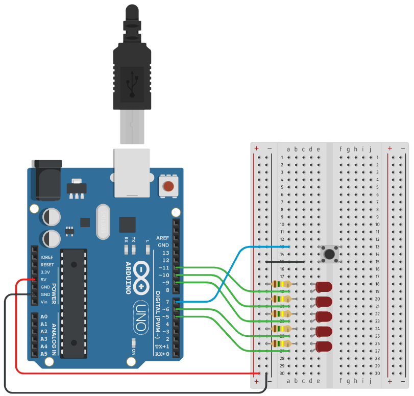

# Lab 2: Ondřej Soukeník
Link to this [Assignment](https://github.com/ondrasouk/Digital-electronics-2/tree/main/Labs/01-tools)
### Active-low and active-high LEDs

1. Complete tables according to the AVR manual.

| **DDRB** | **Description** |
| :-: | :-- |
| 0 | Input pin |
| 1 | Output pin|

| **PORTB** | **Description** |
| :-: | :-- |
| 0 | Output low value |
| 1 | Output high value|

| **DDRB** | **PORTB** | **Direction** | **Internal pull-up resistor** | **Description** |
| :-: | :-: | :-: | :-: | :-- |
| 0 | 0 | input | no | Tri-state, high-impedance |
| 0 | 1 | input | yes | MCU. will source current if ext. pulled low |
| 1 | 0 | output | no | Output low (sink) |
| 1 | 1 | output | no| Output high (source) |

| **Port** | **Pin** | **Input/output usage?** |
| :-: | :-: | :-- |
| A | x | Microcontroller ATmega328P does not contain port A |
| B | 0 | Yes (Arduino pin D8) |
|   | 1 | Yes (Arduino pin D9) |
|   | 2 | Yes (Arduino pin D10) |
|   | 3 | Yes (Arduino pin D11) |
|   | 4 | Yes (Arduino pin D12) |
|   | 5 | Yes (Arduino pin D13) |
|   | 6 | No |
|   | 7 | No |
| C | 0 | Yes (Arduino pin A0/D14) |
|   | 1 | Yes (Arduino pin A1/D15) |
|   | 2 | Yes (Arduino pin A2/D16) |
|   | 3 | Yes (Arduino pin A3/D17) |
|   | 4 | Yes (Arduino pin A4/D18 |
|   | 5 | Yes (Arduino pin A5/D19) |
|   | 6 | Yes (Arduino pin RST) |
|   | 7 | No |
| D | 0 | Yes (Arduino pin RX D0) |
|   | 1 | Yes (Arduino pin TX D1) |
|   | 2 | Yes (Arduino pin D2) |
|   | 3 | Yes (Arduino pin D3) |
|   | 4 | Yes (Arduino pin D4) |
|   | 5 | Yes (Arduino pin D5) |
|   | 6 | Yes (Arduino pin D6) |
|   | 7 | Yes (Arduino pin D7) |

2. Part of the C code listing with syntax highlighting, which blinks alternately with a pair of LEDs; let one LED is connected to port B and the other to port C:

```c
int main(void)
{
    // Green LED at port B
    // Set pin as output in Data Direction Register...
    DDRB = DDRB | (1<<LED_GREEN);
    // ...and turn LED off in Data Register
    PORTB = PORTB & ~(1<<LED_GREEN);

    // Configure the second LED at port C
    // Set pin as output in Data Direction Register...
    DDRC = DDRC | (1<<LED_PC5);
    // ...and turn LED on in Data Register
    PORTC = PORTC | (1<<LED_PC5);

    // Infinite loop
    while (1)
    {
        // Pause several milliseconds
        _delay_ms(BLINK_DELAY);
        PORTB = PORTB ^ (1<<LED_GREEN);
        PORTC = PORTC ^ (1<<LED_PC5);
    }

    // Will never reach this
    return 0;
}
```


### Push button

1. Part of the C code listing with syntax highlighting, which toggles LEDs only if push button is pressed. Otherwise, the value of the LEDs does not change. Let the push button is connected to port D:

```c
    // Configure Push button at port D and enable internal pull-up resistor
    // Set pin as input in Data Direction Register...
    DDRD = DDRD & ~(1<<BT_PD7);
    // ...and use pull-up in Data Register
    PORTD = PORTD | (1<<BT_PD7);

    // Infinite loop
    while (1)
    {
        // Pause several milliseconds
        _delay_ms(BLINK_DELAY);
        // test if button is pressed (connected to GND => 0), if not the 
        // pullup resistor takes voltage at the input port to logic 1.
        if(bit_is_clear(PIND, 7))
        {
            PORTB = PORTB ^ (1<<LED_GREEN);
            PORTC = PORTC ^ (1<<LED_PC5);
        }
    }
```


### Knight Rider

1. Scheme of Knight Rider application, i.e. connection of AVR device, five LEDs, resistors, one push button, and supply voltage. The image can be drawn on a computer or by hand. Always name all components and their values!

   

